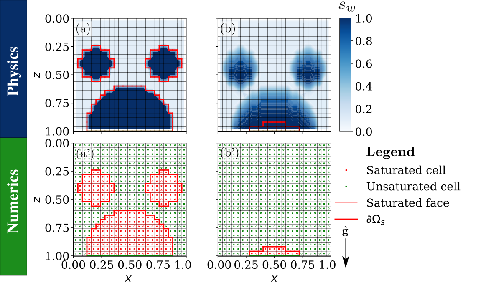

# VarSatFlow: A Variably Saturated groundwater Flow model (Paper [PDF](https://arxiv.org/abs/2210.04724))

In this repository, we present an efficient, conservative and large scale numerical simulator for variably saturated flow in the limit of negligible capillary forces. The model modifies Richards equation to capture complete saturation. Here we implement a tensor product grid-based conservative finite difference solver. The codes are written in Open Source Discrete Operator Toolbox (PyDOT) developed by Shadab based on Hesse's toolbox in MATLAB (MDOT). The codes include one and two-dimensional tests which have been validated with Hydrus simulations, experiments and hydraulic theory. The repository contains codes of variably saturated groundwater model to replicate the figures in Shadab and Hesse (2024), Advances in Water Resources, Elsevier.

 
 

 

  Figure : Gravity-dominated drainage of multiple saturated drops across an unsaturated porous medium

## Associated Paper / Citation to use
Shadab, M.A. and Hesse, M.A., 2024. A hyperbolic-elliptic PDE model and conservative numerical method for gravity-dominated variably-saturated groundwater flow, Advances in Water Resources, Elsevier.

## Authors
- Mohammad Afzal Shadab (mashadab@utexas.edu)
- Marc Andre Hesse (mhesse@jsg.utexas.edu)

## Affiliation
Oden Institute for Computational Engineering and Sciences / Jackson School of Geosciences / University of Texas Institute for Geophysics
The University of Texas at Austin

### Example: Infiltration in soil with an impermeable soil layer leading to formation of a perched water table

https://github.com/mashadab/VarSatFlow/assets/39770999/e8a09d0c-3f0a-4a8c-9c04-8a278be08c10

Video : Flux partitioning in a steady gravity current passing symmetrically over a barrier. $`s_w`$ is the water saturation which is the fraction of pore space occupied by water. Left: Actual video, Right: Saturated region being tracked with solid red line being saturated-unsaturated region boundary.

Figure : Flux partitioning in a steady gravity current passing over a barrier. 
(a-d): Experiments conducted by Hesse and Woods (2010). 
(e-f): Simulations performed using the VarSatFlow model. 

(i) Dependence of the flux partitioning, $`Q_b/(Q_a+Q_b)`$, on the source location, $`L_a/(L_a+L_b)`$, with subscript a is left side and b is right side variable. 

The panel labels give the dimensionless source locations, $`L_a/(L_a+L_b)`$.

### Dependences
hyperbolic-infiltration-theory requires the following packages to function:
- [Python](https://www.python.org/) version 3.5+
- [Numpy](http://www.numpy.org/) >= 1.16
- [scipy](https://www.scipy.org/) >=1.5
- [matplotlib](https://matplotlib.org/) >=3.3.4

### Quick Usage
After cloning the repository and installing the required libraries, run the python files corresponding to the figure numbers as given in the paper. Codes can be run either directly or on an IDE such as Anaconda Spyder. Use `%matplotlib qt` to change the plotting from inline to separate window in Spyder. The resulting plots are collected in the folder `Figures`.

### Non-dimensionalization
The depth coordinate $`z`$ is scaled with characteristic length $`z_0`$, time is scaled with characteristic time $`z_0/f_c`$ and infiltration rate $`I(t)`$ (or volumetric flux) is scaled with the infiltration capacity $`f_c`$ or surface saturated hydraulic conductivity $`K`$. Therefore, the dimensionless variables are $`z'=z/z_0`$, $`t'=tf_c/z_0`$, and $`f'=I(t)/f_c`$.

